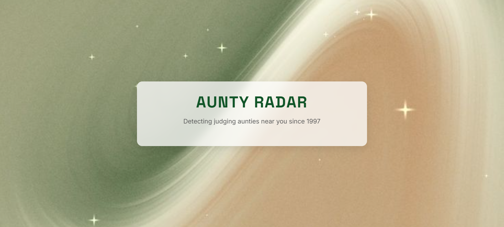
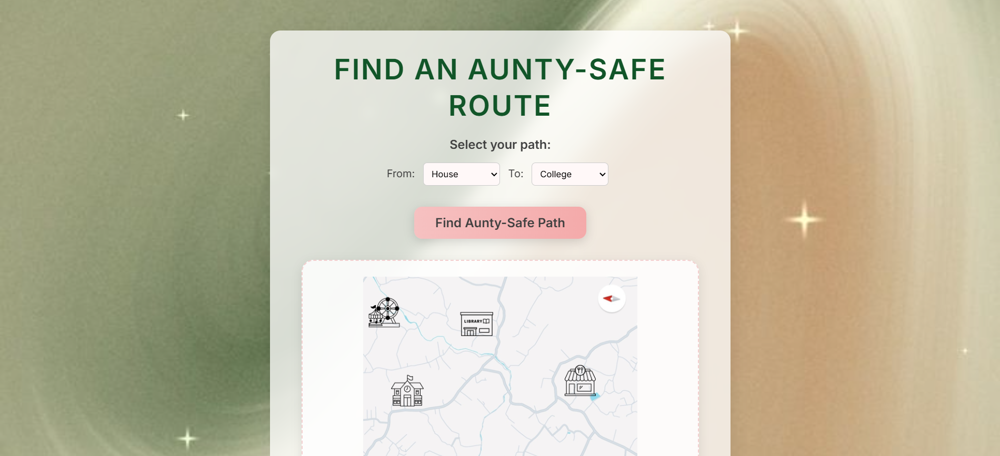
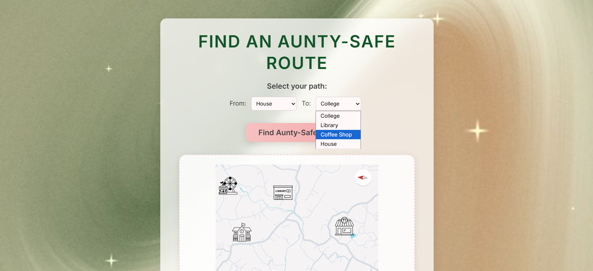
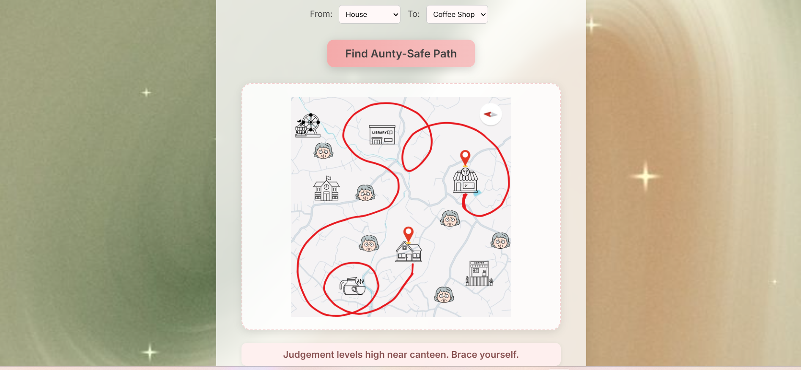
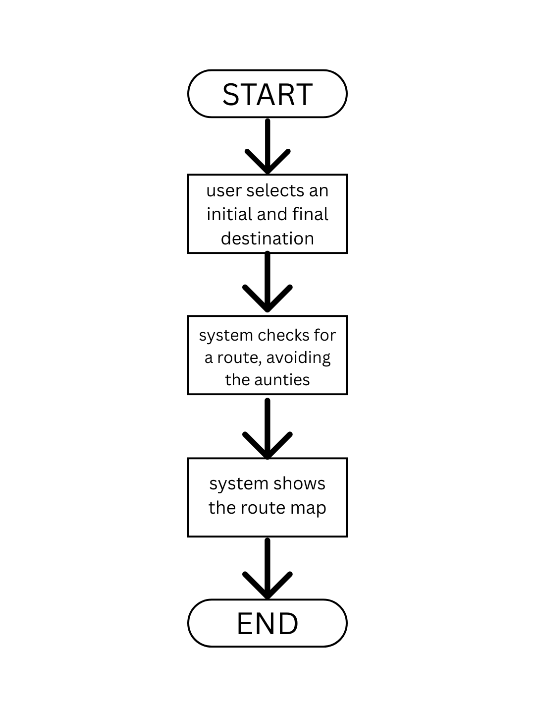

# AUNTY RADAR 🎯

## Basic Details

### 
- Sneha Maria - LBSITW

### Project Description
Aunty Radar is a lighthearted, interactive web app that helps you find safer, more judgment-free walking paths by avoiding the infamous "aunty zones"—those places where you're likely to be judged for simply existing.

### The Problem (that doesn't exist)
Too many "aunties" judging you for what you wear, who you’re with, or how late you're out.

### The Solution (that nobody asked for)
A location-based route system that helps you choose the aunty-safe path—because your business is your business.

## Technical Details
### Technologies/Components Used
For Software:
- Languages: HTML, CSS, JavaScripT
- Libraries: None
- Tools: Visual Studio Code, Git, GitHub

For Hardware:
- Not applicable

### Implementation
For Software:
# Installation
git clone https://github.com/snehamaria1105/-UselessProject.git  
cd aunty-radar  

# Run
Open index.html in any browser

### Project Documentation
For Software:

# Screenshots (Add at least 3)
Screenshot1 
*A welcome page of the website*

Screenshot2 
*Landing page where you start your aunty-safe journey*

Screenshot3 
*A dropdown from where you can select you initial and final destination*

Screenshot4 
*The window that shows a useless but "smart" path in which you can avoid all the judging aunties on the way*

# Diagrams
Workflow Diagram 
*Add caption explaining your workflow*

---
Made with ❤️ at TinkerHub Useless Projects 

